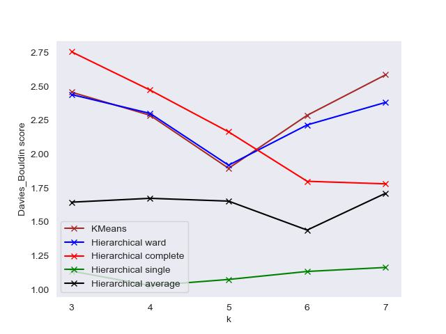
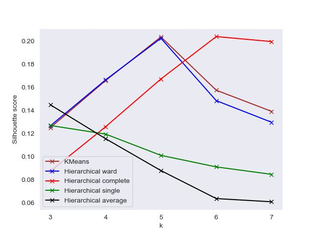
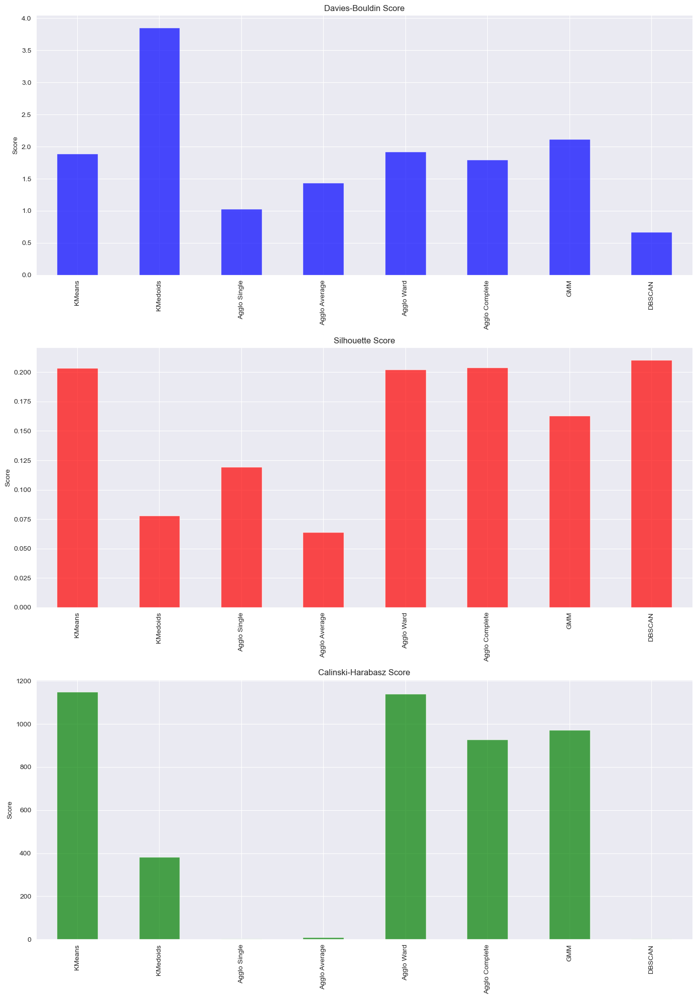

# Raport walidacyjny 
## grupy tworzącej projekt "Soccer Players Clustering", czyli Anny Ostrowskiej i Michała Iwaniuka
### Paweł Florek, Mateusz Deptuch

---
## Opis projektu
Celem  było zapoznanie się z pojęciem klasteryzacji.
Tematem projektu była klasteryzacja danych piłkarskich z platformy kaggle: https://www.kaggle.com/datasets/spicemix/soccer-detailed-players-match-data?resource=download&select=players_away_matches.csv
Projekt realizowany był przez Annę Ostrowską i Michała Iwaniuka.

## 1. KM1 - EDA
**rady od zespołu walidatrów:**
+ Mógłby się pojawić ogólny opis ramki danych oraz co zawiera. Niekoniecznie wszystkie 127 kolumn, ale kilka zdań z czym macie doczynienia oraz wykresy przedstawiające dane. Będzie łatwiej zrozumieć innym.
> wzięte po uwagę  
+ Brak sprawdzenia czy nie ma outlierów, czy przy pomocy boxplota lub scattera.  
> wzięte po uwagę  
+ Brak biznes planu lub czemu by mogła służyć klasteryzacja.  
> wzięte po uwagę  
+ Mogliście spróbować użyć np. TSNE i pokazać dane oraz czy sprawdzić czy nie widać już jakichś ugropowań  
> wzięte po uwagę w kolejnym etapie  
+ raczej nie powinno się dzielić danych na "train" i "val"  
> wzięte po uwagę  

## 2. KM2
**rady od zespołu walidatrów:**

+ 0.7 to dość niski threshold przy usuwaniu skorelowanych kolumn
> nie wzięte pod uwagę z powodu dużej liczby kolumn
+ czy usunięcie nazwy drużyny to na pewno dobry pomysł?
> rozważone ale nie wzięte pod uwagę
+ wyniki klasteryzacji na danych walidacyjnych podobne, dobra robota

## 3. KM3
**rady od zespołu walidatrów:**
+ wizualizja klastrów, fajnie gdyby w prezentacji chociaż była
+ analiza czym się różnią klastry, czym się model kieruje
+ czemu dbscan w metryce Calinskiego-Harabsza wypada tak słabo, skoro w pozostałych jest jednym z najlepszych
+ wyniki podobne, jedynie trochę inne wykresy porównujące w AgglomerativeClustering, jednak nie wpłyneło to na ostateczny wybór, więc dobra robota
> Prace nad projektem jeszcze trwały, więc nie byliśmy w stanie stwierdzić czy modelarze przyjęli nasze uwagi.

  
  

  
  

  
  

>na lewo wyniki walidatorów, prawo modelarze

## Podsumowanie
Współpraca z zespołem modelarzy układała się bardzo dobrze. Zawsze starali się odnieść do naszych uwag oraz ewentualnie ulepszyć swój projekt. Przygotowani byli na czas, dzięki czemu walidacja zawsze była gotowa przed kamieniami milowymi. Przygotowany przez nich kod działał bez zarzutów na zbiorze walidacyjnym i dawał podobne rezulataty.